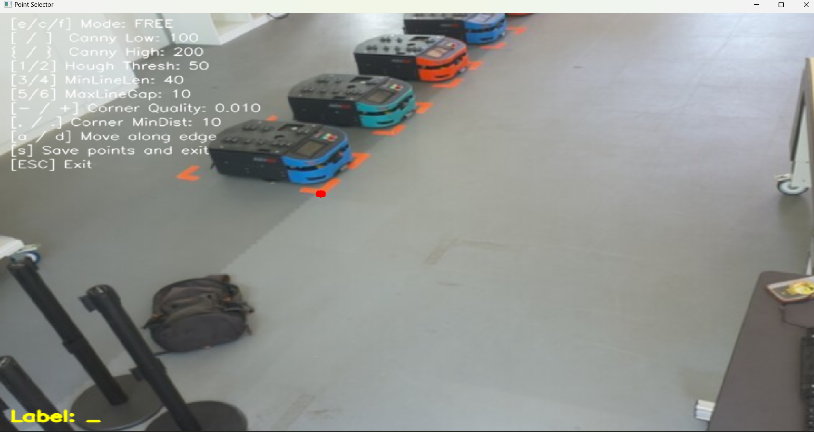
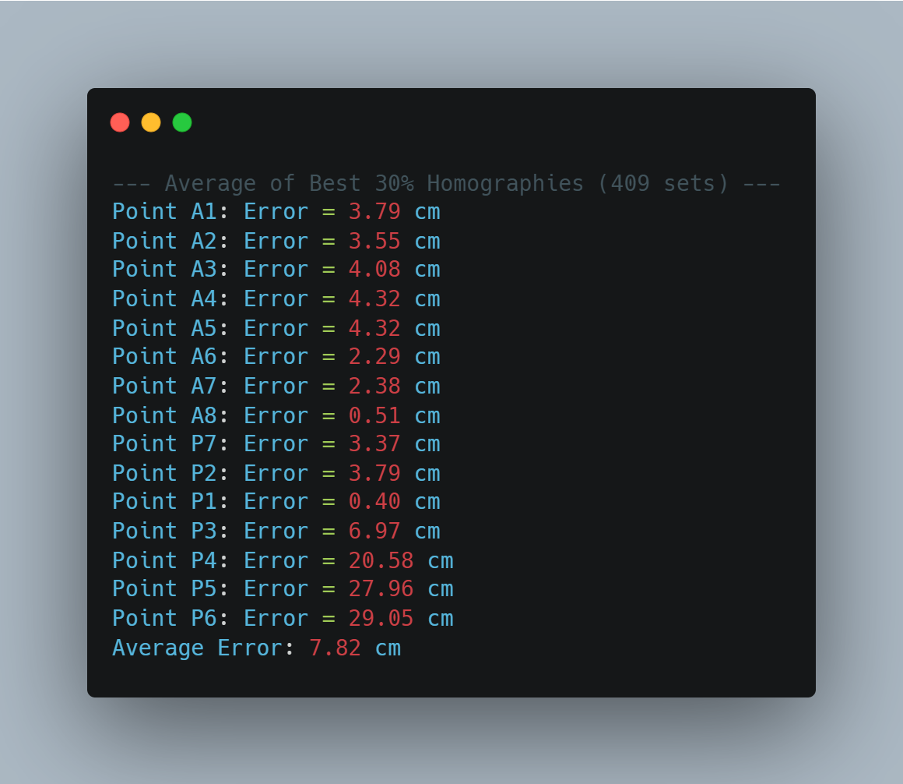

# Single Camera Localization System
## About
This repository contains the complete codebase needed for the **homography matrix calculation between a floor plane and an image**, to be implemented on a **Raspberry Pi 5** using the **Sony IMX500 AI camera module**.
The system works by capturing a picture, selecting points for which the corresponding world coordinates are known, and calculating a fitting homography matrix out of it.

### Requirements
To run the system, you will need:

 -  **Raspberry Pi 5** with Sony **IMX500 AI camera**
 -  **Windows or LINUX personal computer** to facilitate the point selection process
 -  **Mapped out room** in which the picture is to be taken, with an arbitrary coordinate system
 -  **At least 4 points** whose coordinates are known in the world coordinate systems, and can be seen in the camera picture
## Overview
### Folder structure
<pre>
├── assets 
│ ├── homography.npy
│ ├── final_grid_map.png
│ ├── homographies/
	│ ├── homography_avg_best.npy
│ └── points/ 
	│ ├── selected_points.csv
	│ ├── world_points.csv
├── 00_capture_jpeg.py 
├── select_points_main.py
├── select_points_utils.py
├── homography_calc_main.py
├── homography_calc_utils.py
├── config.py
├── requirements.txt # Dependencies
└── README.md # This file
</pre>
#### Code files
The code can be broken down in:
 - `00_capture_jpeg.py`: can be run directly, takes a picture with the RPI AI camera
 - `select_points_main.py`: main function to read the picture taken by the previous file. Allows the user to zoom in and click on any point. The points are then named to match `assets/points/world_points.csv` and saved to `assets/points/selected_points.csv`
 - `select_points_utils.py`: file containing the functions used in the corresponding main
 - `homography_calc_main.py`: main function to calculate the homography matrix. Executes the functions in `utils.py`to create the homography matrices corresponding to the given points. It also tests the error of the resulting homography matrices, and saves the best ones in the `assets/homographies/`directory
 - `homography_calc_utils.py`: file containing all the functions used in the corresponding main script
 - `config.py`: all configurable parameters are set here
#### Assets
 - `homographies/`: directory where the homographies are saved
 - `points/`: directory where the points are saved. `points/world_points.csv`must be created manually with the real coordinates of the points used for the homography

## Installation instructions
### PIP Installation of Requirements

Create a virtual environment using:

```
python3 -m venv venv --system-site-packages
source venv/bin/activate
```

Then install dependencies with:

```
pip install -r requirements.txt
``` 

### Installation of Other Libraries and Packages

The `picam2` and `libcamera` packages are **not installed via pip**. To install them:

```
sudo apt update
sudo apt install -y libcamera-dev python3-libcamera
sudo apt install python3-picamera2
```

Or follow the official Raspberry Pi documentation for the camera stack:  
 [Picamera2 User Guide (PDF)](https://datasheets.raspberrypi.com/camera/picamera2-manual.pdf)

### Download of Asset Files
Assets files can be downloaded directly by cloning this repository. Remember that the `world_points.csv` is specific to each room, and the picture specific to each camera position. If the camera is even slightly moved, the selected points´s camera coordinates must be found again.

## Usage instructions
### Selecting the points to perform the homography with
One of the most critical requirements for a well-functioning homography is the selection of appropriate points. As in this project the intention is to perform floor localization, we are restricting our point selection to the floor plane. Additionally, some basic rules are:
1. Look for points which are easily visible from all the cameras mounted into the lab, and will preferably have sharp edges, so that the exact position can be selected precisely.
2. Look for points with a high colour contrast against the floor, again to facilitate the precise selection of a pixel in the picture
3. Avoid colinear points to pose the homography matrix well. For more information on the mathematical background of the homography, see the [OpenCV documentation](https://docs.opencv.org/4.x/d9/dab/tutorial_homography.html)
4. Our code averages the most precise homography matrices computed from all possible point combinations. Therefore, the quality of the results depends on the number of input points. A good starting point is having 10 points

### 1. Capturing the image:
On the terminal, run 
```
python 00_capture_jpeg.py
```
All the relevant parameters are to be found in `config.py`.
### 2. Selecting the points
#### 1. Purpose
This tool allows you to **interactively select points** on an image taken with the IMX500 camera, assign labels to them, and **save their pixel coordinates** to a `.csv` file. These pixel locations are later used together with known real-world coordinates to calculate a **homography matrix**.
#### 2. How to Launch

```
python select_points_main.py
```
- A window will open with the image defined in `config.py`
- You can zoom, pan, and click on the image to select points
- After clicking, you must **type a label name** and **press Enter** to confirm

#### 3. Interface Overview
You will see:
- A **zoomable, pannable** OpenCV window
- **Points** or **edges/corners** overlaid (depending on mode)
- A **HUD** on the top-left with keybinds and parameter info
- A **yellow label prompt** at the bottom when naming a point
> Figure 1: GUI usage example


#### 4. Mouse Controls
| Action             | Description                             |
|--------------------|-----------------------------------------|
| **Left-click**     | Select a point                          |
| **Click + Drag**   | Pan the view                            |
| **Scroll Wheel**   | Zoom in/out (centered on the mouse position) |

#### 5. Labeling a Point
After clicking:
- A yellow label prompt appears at the bottom
- Start typing your label (e.g. `A1`, `corner_top_left`)
- Press **`Enter`** to confirm
- Press **`ESC`** to cancel
- Press **`Backspace`** to delete characters
Saved points are stored as `(label, x, y)` in:
```bash
assets/points/selected_points.csv
```

#### 6. Selection Modes
Use these keys to switch modes:
| Key | Mode       | Description                                                                 |
|-----|------------|-----------------------------------------------------------------------------|
| `f` | **Free**   | Click anywhere on the image (default)                                       |
| `c` | **Corner** | Click on corners detected using OpenCV's `goodFeaturesToTrack()`            |
| `e` | **Edge**   | Select points along detected lines using the Hough Transform                |
#### Navigation in Edge Mode:
`a` and `d` move backward and forward through detected edge points respectively. When reaching the start or end, navigation stops.
| Key | Action                      |
|-----|-----------------------------|
| `a` | Move **backward** along edges |
| `d` | Move **forward** along edges  |

#### 7. Adjusting Detection Parameters (Live)
Use these keys to tune detection parameters on the fly:
| Parameter            | Keys              | Description                            |
|----------------------|-------------------|----------------------------------------|
| **Canny Low**         | `[` / `]`         | Lower threshold for edge detection     |
| **Canny High**        | `{` / `}`         | Upper threshold for edge detection     |
| **Hough Threshold**   | `1` / `2`         | Line strength needed for detection     |
| **Min Line Length**   | `3` / `4`         | Minimum length of a detected line      |
| **Max Line Gap**      | `5` / `6`         | Gap allowed between line segments      |
| **Corner Quality**    | `-` / `+` or `=`  | Quality level for corner detection     |
| **Corner Min Dist.**  | `,` / `.`         | Minimum spacing between corners        |
The **HUD** always displays the current values.

#### 8. Saving and Exiting
| Key     | Action                               |
|---------|--------------------------------------|
| `s`     | **Save** selected points to CSV and exit   |
| `ESC`   | **Exit** the program without saving  |
> Once saved, the file is ready for use in the homography calculation step.

#### 9. Troubleshooting

| Issue                        | Suggestion                                                    |
|-----------------------------|---------------------------------------------------------------|
| Image doesn't load          | Check `IMAGE_FILENAME` in `config.py`                         |
| No corners or edges appear  | Adjust thresholds using keyboard controls                     |
| Nothing happens on click    | Make sure program is not waiting for label input                  |
| Can't pan or zoom           | Click the window and try again; the OpenCV Window might have lost focus  |
| Homography calculation fails | Verify that `assets/selected_points.csv` and `assets/world_points.csv` have matching labels and enough points (at least 4)

#### 10. Tips for Best Results

- **Zoom in** before selecting a point for pixel-level accuracy
- Use **Corner** or **Edge** mode to align with real-world features (walls, intersections)
- Keep a consistent naming convention that matches `world_points.csv`, as the point names must match exactly for the homography to be evaluated
- Select well-distributed points (not clustered together)
- Avoid points near the image edge where distortion is higher

 The quality of the homography heavily depends on your point selection!
Make sure to double-check your image setup and labeling for consistency.
### 3. Calculating the homographies
On the terminal, run `homography_calc_main.py`. All the parameters are to be set in `config.py`. The only parameter relevant to the performance of the homography is `PERCENTAGE_BEST_HOMOGRAPHIES`, which influences the percentage of homographies to be taken into account for the final homography which is to be saved.

The results of the homographies are evaluated, and shown in the console. An example of this can be seen in Figure 2, where the results are deemed satisfactory, with an average error below 8cm.
 Figure 2: Precision of the homography calculation for a given set of points
### Troubleshooting error messages
### Recommendations
- Use as many points as possible: the quality of the homography depends on that
- Take enough time to properly select the pixels corresponding to the points
- Before taking the picture, ensure that the trained CNN can detect objects properly with this exact position

## Development instructions
During the testing phase of the project, the code has gone through thorough testing, with bugs and problems not appearing during the process. However, the code can still be further developed to increase its functionality.
###  00_capture_jpeg.py functionality
Simple program, adapted from the provided Picamera2 examples. Configurable parameters such as image size and file name are in the  `config.py` python file.
### select_points_main.py functionality
Main code for the selection of points. It shows the image with `cv2.imshow`, and then checks for user input (mouse movement, keys), and calls the corresponding functions from `select_points_utils.py`.
### select_points_utils.py functionality
This module provides:
- **Edge and corner detection functions:**
  - `detect_features` — detects edges, Hough lines, and corners from the input image
  - `find_nearest_point` — finds the closest point to a given coordinate from a list of points
  - `clamp` — utility function to restrict values within specified bounds
- **Mouse interaction handling:**
  - `mouse_callback` — processes mouse events like clicks, drags, zooming, and point selection
- **Visual interface elements:**
  - `draw_hud` — draws the heads-up display overlay with controls and parameter info
- **Data saving:**
  - `save_points` — exports selected and labeled points to a CSV file
- **Integration:**
  - Designed to support and be used by the main script `select_points_main.py`

### homography_calc_main.py functionality
Main function for the calculation of the homography matrices. It loads all relevant files, as defined in `config.py`.
It then calculates all possible homographies for the given set of point, creating one homography matrix for each not colinear set of points. It then evaluates all homographies, and selects the 2 with the lowest average error, the average of all, and the average of the best resulting ones by taking a best percentile again defined in `config.py`. Lastly, it outputs the error for each of the best homographies and best points to the console.
### homography_calc_utils.py functionality
This module provides:
- **File import:**
	- `load_points`loads the CSV file containing the world CS points
- **Homography calculation:**
	- `are_points_colinear`checks for colinearity of points, with the threshold being defined in `config.py`. This is relevant to avoid creating homography matrices with colinear points, which would result in an underdetermined equation system
	- `compute_homography`takes in the world and camera coordinate system points, and calculates the homography with them. It returns the homography matrix
	- `average_homographies`  takes the element-wise average of the provided homography matrices
- **Homography evaluation:**
	- `evaluate_homography`matches the points from the camera and world coordinate points, and calculates the difference (error) between them
	- `print_evaluation`is a self explanatory function, which simply calls the `evaluate_homography` function and prints the evaluation of the provided homography

### config.py functionality
Python file containing the configurable parameters relevant to the files in this directory.

## Known shortfalls
### Image capture
Due to the required resolution compatible with our YOLOv8n network, the size of the image must be (640,640). Additionally, images captured by any camera inherently suffer distortion. Although they can be corrected via a calibration process, which is standard in OpenCV usage, they cannot be completely eliminated. 

Camera calibration has been tested for this project, and the error was doubled, as the calibration does not deliver a perfectly undistorted image, specially at the edges. Additionally, using camera calibration at the homography calculation would force us to undistort every frame during object detection, which would be very expensive computationally. We do not recommend calibrating the cameras.
### Point selection
Due to the size of the image we are using (640,640) the resolution is quite limited. This prevents us from selecting the precise pixel where an edge is located. Edge and corner detection are included in our program, but their effectiveness is limited.
### Homography estimation
The estimation of a homography is purely mathematical, it has no limitations in itself. There are however several sources of error, such as the measurements of the real world points, the selection of the precise pixels as described in the previous step, and the distortions introduced by every camera. 
### Homography validation
The validation of the homography uses all the points which are used for the homography calculations. This results in a 0 error for the 4 points used for each individual homography matrix. Therefore, this must be taken into account when evaluating the results. If 4 points deliver an extremely low error (0-1 cm), these results should be treated with caution or discarded.

