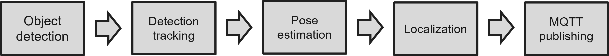
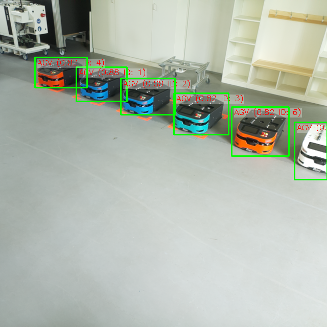

# Single Camera Detection and Localization System
## About
This repository contains the complete codebase for a **real-time object and human detection and localization system**, implemented on a **Raspberry Pi 5** using the **Sony IMX500 AI camera module**.

The system detects objects in the environment, tracks them across frames, estimates ground position, and communicates results to an MQTT broker.
### Requirements
To run the system, you will need:
1.  **Raspberry Pi 5** with Sony **IMX500 AI camera**
2.  **Neural network** in `.rpk` format (e.g., YOLOv8n or custom-trained)
3.  **Homography matrix** from camera to ground-plane
4.  **Room layout image** or graph for visualization
5.  **MQTT broker** information, including certificates and keys
6. **Python installation** on the RPI, Python 3.11 recommended
## Overview
### Pipeline diagram
 Figure 1: Single camera pipeline
### Folder structure
<pre>
├── assets/ # Static resources  
│ ├── homography.npy
│ ├── final_grid_map.png
│ ├── mqtt/ # MQTT certificates and keys
	│ ├── student1.crt
	│ ├── student1.key
	│ ├── student2.crt
	│ ├── student2.key   
│ └── networks/ # Neural networks (.rpk) and labels 
	│ ├── labels_v3.txt
	│ ├── yolov8n_3.rpk
├── detection.py # Object detection on the IMX500  
├── tracking.py # Object tracking with ByteTrack  
├── pose.py # Pose estimation (e.g., feet detection)  
├── location.py # Ground position estimation  
├── mqtt_client.py # MQTT client for sending results  
├── main.py # Threaded main controller  
├── parameters_file.py # Centralized configuration  
├── requirements.txt # Python dependencies  
└── README.md # This file
</pre>
#### Code files
The code can be broken down in:
 - `detection.py`: YOLO (or any other neural network in .rpk format) to detect objects and label them. The network is run directly on the RPI AI camera
 - `tracking.py`:  ByteTracker object tracking to conserve detections in spite of partial occlusions, and allow for continuity in the detection of objects
 - `pose.py`: Pose estimation for improved precision in people recognition
 - `location.py`: Homography to localize objects or people in a plane, given an image. The position is plotted in real time on a map
 - `mqtt_client.py`: MQTT protocol based sending of data to a broker
 - `main.py`: main function using threading to detect and locate objects, and send their position to a server through MQTT protocol communication. This code is based on an already provided example in the `picamera2` [repository](https://github.com/raspberrypi/picamera2/tree/main/examples/imx500)
 - `parameters_file.py`: A config file to change parameters centrally.
#### Assets
- **Homography matrix** establishing the relationship between the camera and world coordinates systems. An entire [sub-repository](../01_calculate_homography/) is dedicated to explain how to set it up.
- **Map of the lab** here provided in the form of a grid
- **MQTT certificates** corresponding to the broker and users
- **Object detecting network** with its corresponding labels
## Installation instructions
### PIP Installation of Requirements
Create a virtual environment using:
```
python3 -m venv venv --system-site-packages source venv/bin/activate
```
Then install dependencies with:
```
pip install -r requirements.txt
```
### Installation of Other Libraries and Packages
The `picam2` and `libcamera` packages are **not installed via pip**. To install them:
```
sudo apt update
sudo apt install -y libcamera-dev python3-libcamera
sudo apt install python3-picamera2
```
Or follow the official Raspberry Pi documentation for the camera stack: 
 [Picamera2 User Guide (PDF)](https://datasheets.raspberrypi.com/camera/picamera2-manual.pdf)
#### Imported ByteTracker
For detection tracking purposes, BYTETracker was selected, due to the good blend between performance and computational expense it offers. The files used for this project have been slightly adapted from this [repo](https://github.com/FoundationVision/ByteTrack/tree/main/yolox/tracker). The only change has been the suppression of imports which were not needed for this project.
### Download of Asset Files
Make sure the following resources are in place:
-   Place `.rpk` model files inside `assets/networks/`
-   Place `labels.txt` next to the model if required
-   Put MQTT certificates and keys in `assets/mqtt/`
-   Save the homography matrix as `assets/homography.npy`
-   Provide a layout map image as `assets/final_grid_map.png`
## Usage instructions
### Running the code
1. Set up `parameters_file.py` according to the specific use-case of the project. If the repository is cloned and the same network is used, recalculating the homography matrix will be enough. For more information on that visit the README in `project_mocas/01_calculate_homography/README.md`
2. Ensure all necessary MQTT certificates are saved under `assets/mqtt`, and that you have network access to establish a connection with the MQTT broker
3. Ensure that the RPI is synchronized with the global time, by resetting the [NTP synchronization](https://raspberrytips.com/time-sync-raspberry-pi/). Connection to the internet is an essential prerequisite:
```
sudo timedatectl set-ntp false
```
```
sudo timedatectl set-ntp true
```
4. Run the file on the console, with:
```
python main.py
```

The `main.py` script launches an OpenCV window (see Figure 2) displaying the real-time camera feed. Detected objects are highlighted with green bounding boxes, annotated with their track ID, label, and confidence score. For human detections, feet positions are marked with a purple dot and labeled "Feet"; interpolated positions are shown in orange.

 Figure 2: Camera feed with overlayed bounding boxes and labels.
### Command line arguments and options
The main script is compatible with command line arguments, with them being explained below. This functionality has been kept to allow for quick experimentation of one or two parameters during testing. However, it is recommended to set the arguments in `parameters_file.py`for better traceability.

| Argument                | Description                                                                                                  | Default/Example                         |
|-------------------------|--------------------------------------------------------------------------------------------------------------|---------------------------------------|
| `--model`               | Path to the object detection model file                                                                     | From `parameters_file.py` (`MODEL_FILE`) |
| `--fps`                 | Frame rate for camera capture                                                                                | From `parameters_file.py` (`DEFAULT_FPS`) |
| `--bbox-normalization`  | Enable/disable bounding box normalization                                                                    | Enabled by default                     |
| `--threshold`           | Confidence threshold for detections                                                                           | From `parameters_file.py` (`CONFIDENCE_THRESHOLD`) |
| `--iou`                 | Intersection-over-Union threshold for non-max suppression                                                   | From `parameters_file.py` (`DEFAULT_IOU`) |
| `--max-detections`      | Maximum number of detections per frame                                                                       | From `parameters_file.py` (`MAX_DETECTIONS`) |
| `--ignore-dash-labels`  | Whether to ignore labels containing dashes                                                                   | Disabled by default                    |
| `--postprocess`         | Post-processing method, e.g., `nanodet`                                                                      | None                                  |
| `--preserve-aspect-ratio` | Preserve aspect ratio when processing images                                                                | From `parameters_file.py`              |
| `--labels`              | Path to the label file                                                                                        | From `parameters_file.py` (`LABELS_FILE`) |
| `--print-intrinsics`    | Print camera network intrinsics and exit                                                                     | Disabled by default                    |
| `--bbox-order`          | Bounding box coordinate order (`yx` or `xy`)                                                                 | From `parameters_file.py` (`DEFAULT_BBOX_ORDER`) |

### Basic functionality
- Script initializes RPI AI camera and loads the given neural network model
- Camera starts capturing frames in real time, processes them and delivers the result to the RPI
- Detected objects are tracked across frames using BYTETracker
- For detected persons, MediaPipe Pose is used to refine foot positions and provide a precise localization. Feet are marked in the image with a dot, with the tag "Feet" or "Interpolated Feet", in case the position of the feet is interpolated
- Positions are projected onto a ground plane using a precomputed homography matrix
- Tracking data (ID, position, confidence, label, timestamp) is sent via MQTT to a central broker
- A live OpenCV window shows the camera feed annotated with bounding boxes, labels, and a top-down map of the lab, which has the detected object positions plotted into it
### Display and interaction
- The OpenCV window labeled "Camera + Map View" will display:
	- The live camera feed with bounding boxes and labels
	- A map view showing tracked positions on the ground plane (if enabled in `parameters_file.py`)
	- Press `Ctrl+C` repeatedly in the terminal to exit the program.
### Troubleshooting error messages
### 4. Troubleshooting

| Issue                        | Suggestion                                                      |
|-----------------------------|-----------------------------------------------------------------|
| Camera does not start        | Verify that the IMX500 camera is properly connected and powered, cable tends to unplug.|
| Model file not found or not valid       | Program raises an exception. Check the `--model` argument or the path in `parameters_file.py`. Ensure that the provided model file is in `.rpk` format. Instructions on how to compress it in the corresponding [repository](../03_code_for_yolov8n/README.md)|
| Labels file missing or incorrect | Program raises an exception. Ensure the `--labels` path is correct and the file exists.     |
| Homography file not found	   | Program raises an exception. Check if the file is correctly referenced in `parameters_file.py`.|
| No detections shown          | Lower the confidence threshold (`--threshold`), check for camera tilt. A tilted camera will impair or even prevent the proper functioning of  a neural network.|
| Tracking is unstable         | Adjust tracker parameters in `parameters_file.py` or check input frame rate.|
| Program crashes on start     | Check that all required certificate files and dependencies are installed.|
| OpenCV window does not display | Make sure the script has access to a graphical environment.    |
| Homography projection incorrect | Confirm the homography matrix is computed and loaded correctly.|
| High CPU usage               | Reduce frame rate (`--fps`) or image size in configuration.     |
| MQTT certificates not found       | Ensure path to the certificates is well defined.           |
| MQTT connection failed            | Program prints error to the console but continues running. Connections has with the MQTT broker has been interrupted. Check if network connection is stable, and if the used network allows for connection to the broker. |

### Recommendations
Due to the complexity of the code and of the environment it is tested in, some recommendations can be given for its use. When summarized, the following can be said: test all modules separately, to ease troubleshooting.
- Ensure that the object detecting model works well on its own/computer before testing it on the RPI. Model compression might affect the quality of the detection
- Ensure that the camera is approximately parallel to the ground. Tilting of the camera severely affects the performance of the object detection
- Ensure that the provided homography works on its own. For more information on how to test it, check the corresponding [README](../01_calculate_homography/README.md)
- Test for the stability of the mounting platform for the RPI and camera system. The components are fragile

## Development instructions
This system is designed for real-time human, AGV and carrier detection and tracking using the RPI AI camera. It uses the following pipeline:
object detection -> tracking -> pose estimation (optional) -> homography projection -> MQTT communication
The following files form the core of the project:
### detection.py functionality

This module provides helper utilities for **object detection visualization**, **label handling**, and **color/position analysis**. These tools improve detection feedback during runtime and assist with downstream logic like position estimation or UI display.

**Key Functional Areas:**

- Efficient label filtering
- Visual annotation of detection results
- Color estimation from image regions
- Ground position estimation (via pose or directly via bounding box)
- Drawing ROIs and resizing maps for visualization

**Function Summaries:**

#### `get_labels_cached`
- Caches and filters label lists.
- Removes empty strings or `"-"` if `ignore_dash_labels=True`.
- Optimized using `functools.lru_cache` for performance.

#### `draw_detection_label`
- Draws a bounding box and a **semi-transparent label** above the box.
- Uses OpenCV functions like `putText` and `addWeighted`.
- Parameters:
  - `frame`: the image to annotate (modified in-place).
  - `label`: text to show.
  - `bbox`: (x, y, w, h) format.
  - Additional options for font, colors, and transparency.

#### `average_color_at_center`
- Computes the **average BGR color** from a small square region at the **center** of a bounding box.
- Kernel size is controlled via `configuration.detection.AVG_COLOR_KERNEL_SIZE`.
- Returns a NumPy array with shape `(3,)`.

#### `get_detection_position`
- Returns an estimated **ground position** of a detected object and a flag indicating if pose landmarks were used.
- Uses `get_ground_position_from_landmarks` if the object is a `"person"` and landmarks are available.
- Otherwise, falls back to a provided function that estimates ground position using the bounding box.

#### `draw_roi`
- Draws a **Region of Interest (ROI)** on the given frame.
- ROI format: `(x, y, w, h)`.
- Draws a rectangle and the label `"ROI"`.

#### `resize_map_to_match`
- Resizes a static map image to match the **height** of the input frame.
- Maintains aspect ratio.
- Useful when compositing side-by-side views or overlays.

**External Dependencies:**

- `pose.get_ground_position_from_landmarks` — for pose-based localization.
- `parameters_file.py` — for kernel size and runtime behavior settings.

**Usage Context:**

This module is typically invoked:
- Inside the **detection loop**, to label bounding boxes.
- When calculating ground positions.
- When composing or displaying a detection map or camera view.

By encapsulating UI and logic helpers here, the main inference pipeline stays clean and focused.

### tracking.py functionality

This module manages **object tracking** using the **BYTETracker** algorithm and maintains metadata for each tracked object. It handles the conversion of detections into BYTETracker format, matching between detections and tracks, and updates per-track label and confidence values. The association of the track to the corresponding label is coded here, as this functionality is not provided natively by the `BYTETracker` library.

**Key Components:**

- **Tracker Initialization:**
  - A global `tracker` instance of `BYTETracker` is initialized using parameters from `configuration.tracking`.
  - Configurable options include:
    - `TRACK_THRESH`, `LOW_THRESH`: Confidence thresholds for keeping and initiating tracks.
    - `MAX_AGE`: How many frames to keep a lost track before deletion.
    - `MATCH_THRESH`, `MOT20`: Matching and MOT version behavior.
    - `FRAME_RATE`: Required for BYTETracker temporal logic.

**Function Summaries:**

- #### `detections_to_bytetracker_format`
  - Converts a list of detection objects into BYTETracker’s expected format:
    - Output shape: `(N, 5)` with columns: `[x1, y1, x2, y2, confidence]`.
  - Handles empty lists gracefully.
  - Used just before feeding detections into the tracker.

- #### `iou`
  - Computes **Intersection-over-Union (IoU)** between two bounding boxes:
    - Input: Two boxes in `[x1, y1, x2, y2]` format.
    - Output: A float between `0.0` and `1.0`.
  - Used to match detections to tracks.

- #### `update_track_metadata(tracks, detections, labels)`
  - Maintains and updates **global metadata** for active tracks:
    - `track_metadata`: Dictionary mapping `track_id` to `{"label", "conf"}`.
    - `track_age`: Dictionary tracking how many frames each ID has gone unmatched.
- Logic:
    1. For each active track, compare with all detections via IoU.
    2. If IoU > threshold (`IOU_THRESHOLD`), update metadata with the detection's label and confidence.
    3. Tracks not matched in the current frame have their `age` incremented.
    4. If `age` exceeds `MAX_AGE`, the track is removed from memory.

#### Intended Usage
Called in the **main detection loop**:

1. Convert detections using `detections_to_bytetracker_format`.
2. Call `BYTETracker` to get updated tracks.
3. Use `update_track_metadata` to attach semantic info (like labels) to tracks.

This module ensures **object identity consistency over time** and supplies each tracked object with useful **semantic metadata**.

### pose.py functionality

This module estimates the **ground position of a person** based on pose landmarks detected by **MediaPipe Pose**. It improves human localization accuracy by inferring real-world coordinates of feet or extrapolated lower-body keypoints, mapped using homography.

**Key functionalities:**

- **Pose estimator setup:**
  - Initializes MediaPipe Pose with lightweight settings (`model_complexity=1`, `static_image_mode=False`).
  - The lightweights settings are used due to the limited computational power of the RPI.
  - Loads drawing utilities for optional visual debugging on frames.
  - The confidence for each detection is set in `parameters_file.py`

- **Ground position estimation:**
  - `get_ground_position_from_landmarks(...)` is the core function:
    - Takes bounding box, pose landmarks, homography matrix `H`, and current image.
    - Checks if the label is `"person"` and landmarks are available.
    - Estimates ground position from visible **foot landmarks**, or if unavailable, interpolates from:
      - **Knee → Ankle** vectors (more accurate).
      - **Hip → Knee** vectors (fallback method).
    - Projects the 2D foot point to real-world coordinates using homography.
    - Returns `(x, y)` position on the ground plane (world space) or `None` if no reliable foot location is found.

- **Visualization:**
  - Draws:
    - Pose skeleton within the bounding box.
    - Detected or inferred foot points.
    - Labels for each method of foot localization (`"Foot"`, `"Foot (interpolated)"`, `"Foot (from hip→knee)"`).
  - Helps with debugging accuracy of the pose-based localization.

---

**Usage:**

- Used in the detection pipeline after a `"person"` is detected in a frame.
- Provides a more accurate **ground localization** than the bounding box bottom, especially useful when cameras are tilted or feet are partially occluded.
- Returned positions feed into downstream components (e.g., MQTT sender, tracking).

---

**Fallback logic (important):**

1. Try **LEFT_FOOT_INDEX** and **RIGHT_FOOT_INDEX**.
2. If missing, interpolate from **knee → ankle**.
3. If still missing, interpolate from **hip → knee**.
4. If both feet are available (real or estimated), use their average to compute position.

This ensures robustness in challenging situations such as partial occlusions or imperfect detections.

### location.py functionality
This module provides tools for projecting detections into real-world ground space and rendering them on a map.
**Key functionalitites:**
- **Homography projection:**
	- `compute_homography`- loads the precomputed Homography matrix (see corresponding [repo](../01_calculate_homography/README.md))
	- `estimate_ground_position`- uses the homography matrix to estimate the ground position of a detected object. It uses the bottom center of the bounding box, as we assume that the detected object is touching the floor, and the entire object is contained in the bounding box
- **Map visualization:**
	- `create_map_background` - loads a gridded map representing the room floor space. The image is scaled to be used in visual overlays.
	- `draw_map_view` - draws the positions of the detected objects into the given floor plan.
**Integration:**
- used in `main.py` to overlay detected object positions on a top-down room layout
- visual output helps validate homography accuracy and overall system reliability
### mqtt_client.py functionality
This module handles MQTT communication for sending tracking data to a remote broker in real time. It is designed to run non-blocking alongside the main detection pipeline and supports secure communication using TLS certificates.
**Key functionalities:**
- **Track data management:**
  - `update_track_storage` – stores metadata for each tracked object (label, confidence, ground position, color, pose usage).
  - Uses thread locks to ensure thread-safe updates.
  - Stores multiple entries per object ID to support selection of best data later.
  - The track data saving is needed due to the MQTT thread not sending data for each single frame, but rather only once in a while. This is due to pose estimation only running once in a fixed time (due to computational power limitations.) As the best precision is only achieved for positions having used pose estimation, the sending of data doesnt happen for every frame.

- **MQTT data selection:**
  - `select_and_clear_data_for_mqtt` – chooses the **most relevant data point** for each track:
    - For `"person"`: prefers entries using pose estimation, as they offer a much higher position accuracy.
    - For other labels: selects the most recent entry.
  - Clears internal storage after data is collected for sending.

- **Secure connection and publishing:**
  - `mqtt_sender_thread`:
    - Establishes a secure MQTT connection using certificate files (TLS).
    - Validates file paths and handles exceptions.
    - Sends data **periodically**, at an interval defined in the configuration file.
    - Converts tracking metadata into a JSON-compatible payload.
    - Publishes the data to a topic, and logs success/failure to the console.

- **Time tracking:**
  - `get_last_sync_time` – returns the UTC timestamp of the last successful MQTT message, useful for synchronization or debugging. Has not been needed so far.

- **JSON serialization:**
  - `make_json_serializable` – recursively converts non-serializable objects (e.g. NumPy arrays and floats) to native Python types before publishing.

**Integration:**
- `mqtt_sender_thread` is started in a background thread from `main.py` ensuring the MQTT loop does not block camera capture or frame processing

### main.py functionality
Main entry point of the system. It initializes the detection and tracking pipeline, starts threads for frame processing and MQTT communication, and runs an infinite loop to capture and process camera frames. Main functionalities:
- **Camera and model setup:**
	- Loads the neural network to the AI camera
	- Loads model parameters, labels and network intrinsics
- **Detection and tracking:**
	- Runs the object detection model on each frame
	- Applies the BYTETracker algortihm to track objects across frames
- **Pose estimation:**
	- Uses MediaPipe Pose Estimation to calculate the positioning of humans by finding the position of their feet
- **Ground position projection:**
	- Computes and applies a homography matrix to project 2D bounding boxes onto real-world floor coordinates
- **Visualization:**
	- Combines live camera view and a top-down map view with real time annotations
- **MQTT communication:**
	- Sends selected track metadata (e.g. label, position, color) to a central broker in a separate thread, to avoid data corruption
**Threading:**
Threading is used to maximize the performance of the system, needed with the limited computational power of the RPI 5. Different threads are used for:
	- Frame processing, drawing and visual output
	- MQTT data transmission

The code itself can be broken down into:
- `Detection`class: defines the detections, objects with bounding box, class and confidence
- `parse_detections`: function parsing the detections given by the RPI AI camera
- `get_args`: function parsing the command line arguments
- `draw_detections`: main function handling the object detection, tracking, localization, pose estimation, MQTT data selection and drawing of the bounding boxes and positions. It serves as the main loop, running in a separate thread.
### parameters_file.py
Contains all configurable parameters of the directory, divided in namespaces accorded to their functionality. This is done to simplify the imports at the individual packages.
## Known shortfalls
### Detection
- Unstable detection of carriers when the wheels are occluded
- Sporadic creation of double detections for a single object
### Tracking
- System is not robust to complete occlusions: limited by BYTETracker architecture
- Unoptimized initialization parameters of bytetracker: low and high confidence thresholds can be further optimized to increase robustness of partial occlusions, and avoid the creation of new tracks
- bytetracker has no native label matching. Label matching has been coded by ourselves, and could therefore be revised
### Pose estimation
- Pose estimation can only be calculated for 1 single object simultaneously due to limitations in computing power
- Thresholds for individual body parts have not been individually tuned for optimal precision, could be done in the future to improve results
- Pose estimation highly depends on the orientation of the detected person, with lower accuracy or failure to recognize the poses of people facing away from the camera
### Localization
- Homography itself is limited, as explained in its corresponding [repository](../01_calculate_homography/README.md)
- Plotting the map results in lowered performance, but its usage can be deactivated in `parameters_file.py`
- Localization relies on the assumption that the bounding box includes the intersection of the object with the floor. If this is not the case, this pipeline will deliver inaccurate results
- A higher number of points for the creation of homography has been proven to increase the accuracy, and should be implemented in the future
- The calculation of the homography matrix and selection of points could eventually be automatized by the usage of a grid with a known size and edge detection
### Clock synchronization
- Clock synchronization for MQTT communication is done with NTP, a method native to the RPI
- This method relies on a network connection, and is only precise in the range of xx ms
- A connection through 5G would effectively solve this limitation

