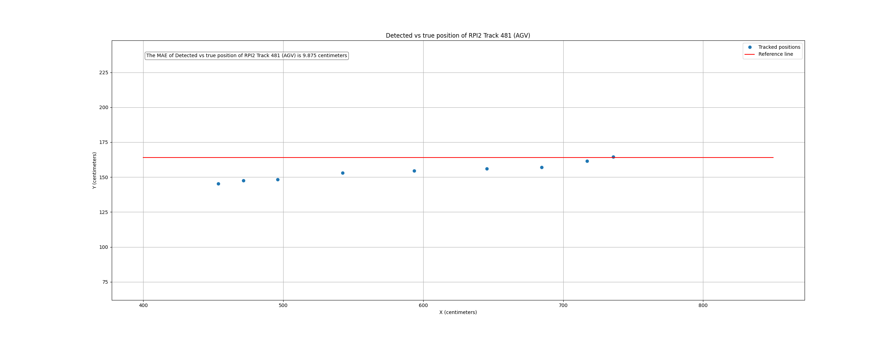
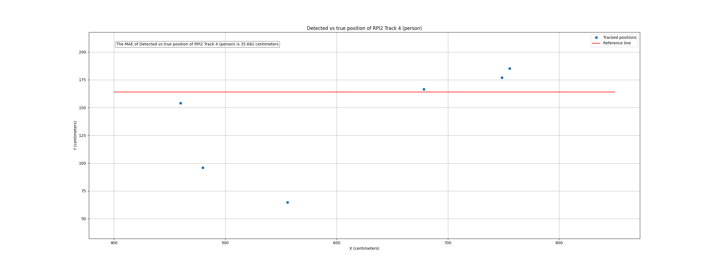
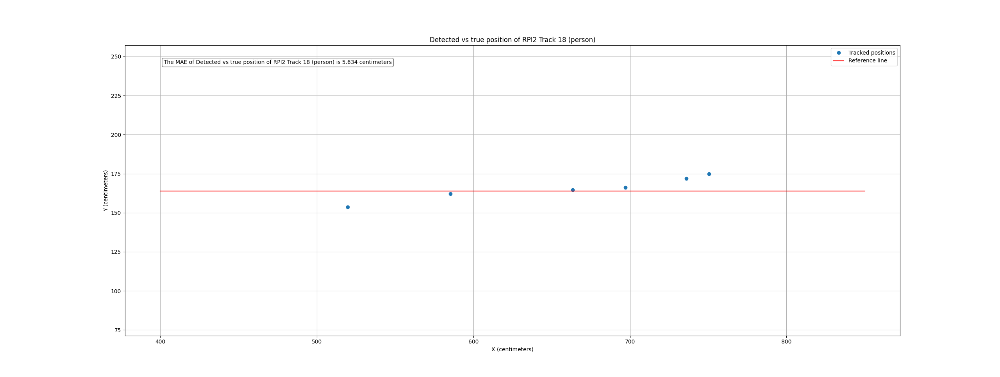
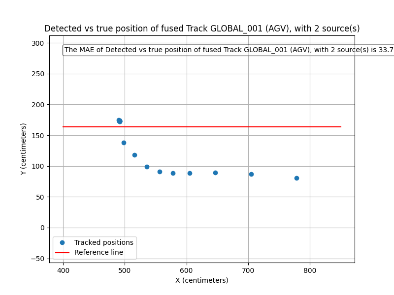

# Multi-RPi Localization Precision Evaluation Tool

## About
This repository provides a modular evaluation pipeline to analyze the precision of a multi-camera localization system.  
It compares raw and fused object tracks against a known ground-truth trajectory and computes the Mean Absolute Error (MAE).  
The system supports fused tracks and individual Raspberry Pi detections, and is designed to work with real logs from your multi-RPi setup.

## Requirements
- Python 3.8+  
- Logs from your RPi localization system in the provided text format  
- Known reference trajectory (e.g., straight-line endpoints)

## Overview

### Folder structure
<pre>
├── config.py           # All tunable parameters (log path, track ID, etc.)
├── data_parser.py      # Custom log parser for RPi and fused tracks
├── evaluation.py       # Precision evaluation (MAE computation)
├── plot_utils.py       # Optional visualization (track vs. ground truth)
├── main.py             # Entrypoint script to run the evaluation
├── requirements.txt    # Python dependencies
├── assets/             # Directory containing the logs to be evaluated and .csv files with results
└── README.md           # This file
</pre>

### Code files

- **config.py**  
Contains all configurable parameters, including log path, track selection, and reference trajectory points.

- **data_parser.py**  
Parses your custom text-based logs (both fused and rpiX sources). Extracts per-frame positions.

- **evaluation.py**  
Computes precision metrics, specifically the Mean Absolute Error (MAE) vs. the reference trajectory.

- **plot_utils.py**  
Generates optional plots showing tracks vs. the ground truth line, and error over time.

- **main.py**  
Runs the entire pipeline: loads data, computes MAE, saves results, and plots output.

## Assets
This repo does not require pre-trained models or neural networks.  
All inputs are based on logs you provide.
## Installation instructions

### PIP Installation of Requirements
```bash
pip install -r requirements.txt
```
## Installation of Other Libraries and Packages
All required libraries are in `requirements.txt`:

- numpy  
- matplotlib  

No additional system packages are needed.

## Download of Asset Files
No external assets are needed. The system works directly with your log files.

## Usage instructions
### Running the code
1. Place your logfile in the repository directory (or set the path in `config.py`).  
2. Edit `config.py` to set:  
   - `LOG_PATH`: Path to the log file  
   - `SOURCE_TO_ANALYZE`: `'fused'`, `'1'`, `'2'`, etc. 
   - `AUTO_SELECT_TRACK`: when enabled, evaluates the track with the most entries for a given source. Its usage is recommended, as we only tracked 1 object at a time for this test.
   - `DESIRED_LABEL`: class of the object whose tracking is to be evaluated.
   - `TRACK_ID`: Track ID to evaluate (e.g., `'GLOBAL_001'` for fused, `'1'` for raw)  
   - `LINE_START`, `LINE_END`: Ground truth reference line  
3. Run:  
```bash
python main.py
```
4. Results will be printed and saved to `assets/`

## Troubleshooting error messages

| Error                    | Cause                       | Solution                          |
|--------------------------|-----------------------------|---------------------------------|
| FileNotFoundError        | Log file not found           | Check LOG_PATH in config.py      |
| ValueError: No data found| Track ID or source not in log| Verify TRACK_ID and SOURCE_TO_ANALYZE |

## Recommendations
- Use consistent track IDs (check your logs before running)  
- Use a well-defined reference trajectory for comparison  
- Visualize outputs to detect systemic errors in fusion or sensor alignment
- Pay attention to the plotted positions and their correspondence with the line: some measurements start too early, so the minimum and maximum x values can be changed to filter out detections saved before the object moved along the test line

## Development instructions

### config.py functionality
Centralized parameters:
- Log file with track information path
- Source to analyze (either fused or single RPI)
- Whether to automatically select the track with most datapoints or manual track selection
- Desired label/class to be evaluated
- Start and end of the line we want to evaluate
- Maximum and minimum X value thresholds, to evaluate objects only when moving close to our line
- Output directory
- Plotting flag
### data_parser.py functionality
Custom parser for text-based logs:  
- For fused tracks: matches `GLOBAL_<id>`  
- For raw tracks: matches `Track <id>`  
- Extracts `[x, y]` positions and timestamps.
- Extracts `num_sources` used in case a fused track is to be evaluated
- Filters out tracks of a given source by a given label, `DESIRED_LABEL`
- Filters out the datapoints to be evaluated given an X value threshold. This is done to use only the points within the line we are evaluating.
- Extracts all the IDs out for a certain logfile and source.

### evaluation.py functionality
- Computes MAE between the track and ground-truth line.  
- Handles line fitting and point-to-line distance calculations.

### plot_utils.py functionality
- `plot_positions_vs_line()`  
  Visualizes track positions vs. the reference line.  
- `plot_error_over_time()`  
  Optional: visualize per-frame error.

### main.py functionality
- Loads data using `data_parser.py`  
- Computes MAE with `evaluation.py`, prints it together with the plot  
- Saves results to assets/  
- Generates plots with `plot_utils.py`
- Automatically selects the track with the most detections for a given source.

## Results evaluation
### Single camera system
#### 1 Test objective
Due to the complexity of the project, the accuracy of the components must be measured separately, to facilitate finding the root cause of the error. Therefore, before testing the datafusion error, the single camera system must be evaluated. 
The system is evaluated by tracking a single object moving along a known line (ground truth). The output positions are compared to this line by computing the Mean Absolute Error (MAE).

#### 2 Test setup
The test is performed at the proto-lab, in the same room used for the general testing of the single camera system. An AGV (and later a person) move across a known line, and a single camera calculates the position of the moving object. This is then logged to a `.txt` file, which is then evaluated with the code provided in this repo.

#### 3 Evaluation methodology
The error is measured using the [MAE](https://www.sciencedirect.com/topics/engineering/mean-absolute-error), computed by comparing the position calculated by the system with the ground truth, provided by a straight line. A single object is moving, to ease track selection from the log.

#### 4 Results presentation
##### 4.1 Quantitative results
| Object | Number of Runs | Average Error (cm)      |
|--------|----------------|------------------------|
| AGV    | 7              | 10.08                  |
| Person | 3              | 7 (with pose estimation) |

##### 4.2 Visual results
Figure 1 shows the resulting MAE error for one of the AGV runs.


Figure 2 shows the error resulting of a person walking along the line, facing away from the camera. 


Figure 3 shows the error resulting from a person walking along the line while facing towards the camera.


#### 5 Analysis and insights
When evaluating the AGV localization accuracy, the behaviour is always similar, with what appears to be random error, usually below 10cm. Most of the error is an undershoot of the position. Due to the nature of the taken test, where the line is parallel to the x axis, the error in the x axis cannot be observed.

When evaluating the accuracy of the person localization, there is a major conclusion to be drawn. The quality of the location is highly dependent on the usage of pose estimation. Furthermore, the quality of the pose estimation is highly dependent on the orientation of the detected person. When the person (partially) faces the camera, the pose estimation algorithm is able to detect its feet, resulting in an average error of around 7cm. However, when the person is facing 90-270° away from the camera, the pose estimation algorithm fails to find the person's feet, drastically reducing the localization accuracy.

#### 6 Conclusion and next steps
The results of the single camera system have proven to be satisfactory when the testing conditions are favourable, with an average error of 7cm for people, and 10cm for AGVs. 

However, the results corresponding to the person localization accuracy are strongly influenced by the orientation of the person with respect to the camera, as pose estimation requires a relatively frontal view of the person in order to successfully locate its feet, which are essential for precise localization of the person. 

As for the localization of AGVs, the results have proven to be consistent across the test case, with errors around 10cm, and mostly within 15cm.

In the future, the pose estimation algorithm should be refined to make it more robust when detecting not frontal humans. Alternatively, the number of cameras can be increased, to ensure that at least one camera is seeing a human frontally. This option would incur in higher costs, both in terms of material and energy as in maintenance and set-up.

Furthermore, the accuracy of the homography could also be a focus for improvement, with the appropriate measures being explained in the corresponding [README](../01_calculate_homography/README.md).

### Data Fusion System
#### 1 Test objective
To assess the precision and robustness of the real-time data fusion system under multi-camera configurations. The goal is to determine how accurately the system can generate globally consistent object tracks by fusing inputs from 2–3 Raspberry Pi cameras. The results will be compared against a known ground-truth trajectory using the Mean Absolute Error (MAE) metric, enabling a direct comparison with the performance of a single-camera setup.

#### 2 Test setup
The test is conducted in a controlled environment (e.g., proto-lab) using the same room configuration as the single-camera tests. An AGV or a person moves along a known straight trajectory (ground-truth line), and the fused positions are calculated using the complete multi-camera system (MQTT + fusion + Kalman filtering). The system logs fused tracks (GLOBAL_<id>) which are later analyzed using the evaluation pipeline.

#### 3 Evaluation methodology
The error is measured using the [MAE](https://www.sciencedirect.com/topics/engineering/mean-absolute-error), computed by comparing the position calculated by the system with the ground truth, provided by a straight line. A single object is moving, to ease track selection from the log.

#### 4 Results presentation
##### 4.1 Quantitative results
| Object | Number of Runs | Average Error (cm)       |
|--------|----------------|--------------------------|
| AGV    | 7              | 33.7 (with 2 sources)    |
| Person | 3              | 4.3 (with 1 source)      |

##### 4.2 Visual results
Figure 1 shows the resulting MAE error for one of the AGV runs.


Figure 2 shows the error resulting of a person walking along the line.


### 5 Analysis and insights
While the data fusion system improved spatial coverage and offered potential for more accurate tracking, testing revealed several critical limitations affecting its performance.A major issue was the fusion breakdown between RPIs—when multiple cameras saw the same object, overly strict thresholds (on position or color) often prevented proper merging, resulting in duplicated global IDs. This was especially noticeable with moving objects or slight color/position differences across views.

Another key limitation was unreliable message handling from RPI1, where messages were sometimes dropped due to the lack of multi-threading. This led to incomplete input during fusion windows and degraded track consistency.Additionally, during fast or continuous movement, the system sometimes generated duplicate fused tracks, assigning new IDs mid-motion due to timestamp mismatches or appearance shifts. This cluttered the map and affected MAE accuracy.Although the fusion approach helped with orientation issues (e.g., pose estimation improving with multiple camera views), the above issues—especially rigid matching logic and inconsistent data—limited its full potential.

#### 6 Conclusion and next steps
The multi-camera data fusion system showed both strengths and weaknesses during testing.
For person tracking, the system performed very well, with an average error of 4.3 cm using just one camera. The extra viewpoints helped pose estimation, especially when at least one camera had a clear view of the person.However, AGV tracking with two cameras had a higher error—about 33.7 cm on average. This drop in accuracy revealed some key problems in the fusion system.

One issue was fusion breakdown: the system sometimes failed to combine detections from different cameras into a single track, especially if the position or color data didn’t match closely enough. Another problem was unreliable messages from RPI1, often caused by the system’s lack of multi-threading, leading to missing data. Also, during fast movement, the system sometimes created duplicate tracks for the same object due to small delays or mismatches.

Next Steps:
1. Robust Color Matching Strategy
      - Differences in lighting, exposure, or camera angles can cause variations in the perceived object color across cameras. Using more lighting-invariant features might reduce mismatches in such cases.
2. Explore Alternative Data Fusion Techniques
      - It may be worthwhile to experiment with alternative fusion architectures such as:
          -  Probabilistic data association (e.g., JPDA)
          -  Graph-based or clustering-based matching   


## Known shortfalls

### Data fusion race conditions
- Evaluated data depends entirely on the logging of data from the data fusion code
- Lack of threading in the data fusion code results in data corruption: not all rpi1 messages are logged, and therefore evaluation of rpi1 is not possible for all available logfiles

### Tracking
- Does not perform new tracking; assumes IDs are assigned during logging  

### Localization
- Relies on homography or prior localization performed in the RPis  
- This tool only evaluates the final results, not the working of the homography itself

### Clock synchronization
- Assumes fused data is already time-aligned  
- No clock sync is handled in this pipeline  
