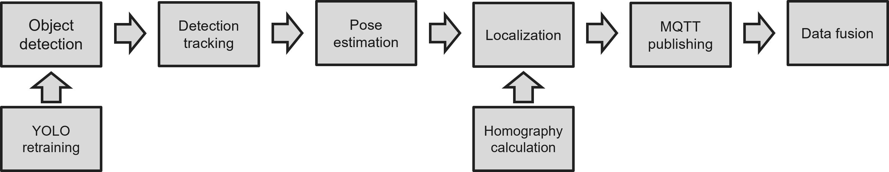
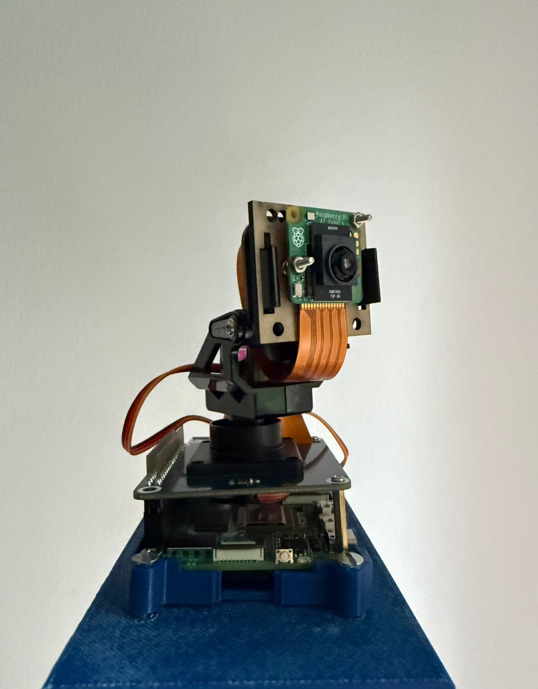
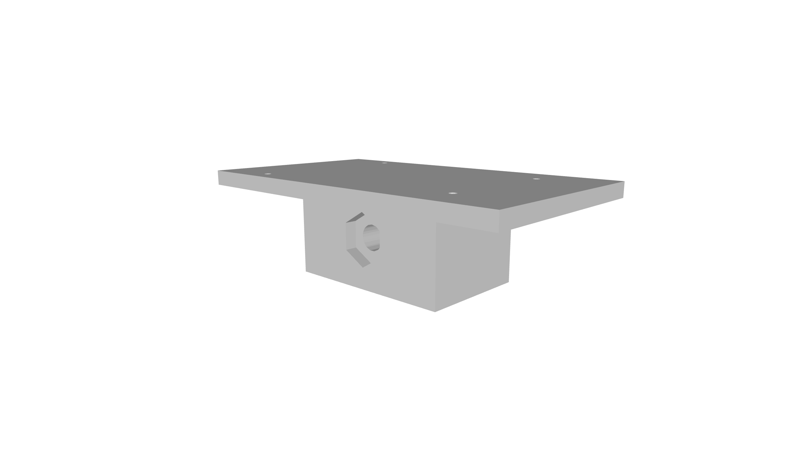
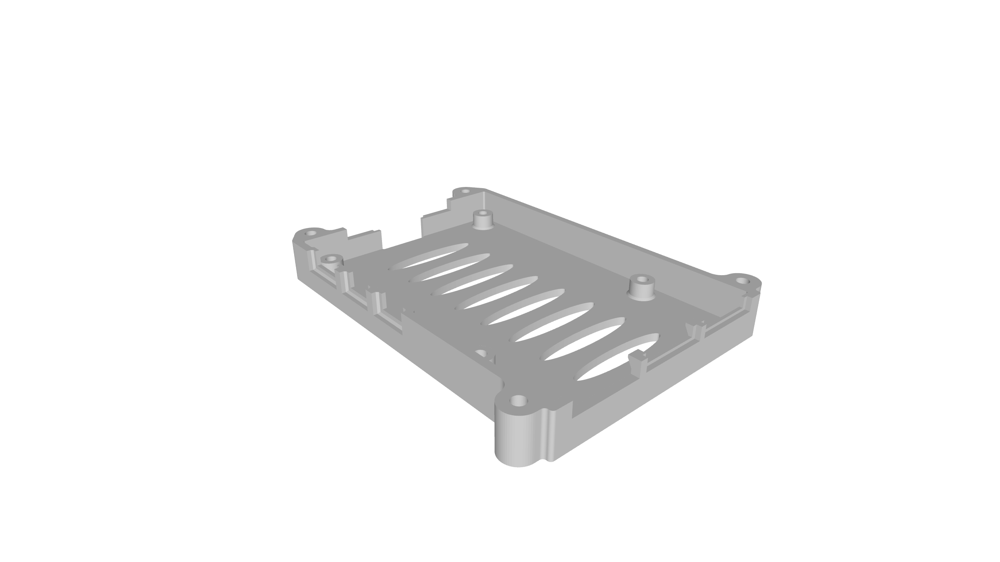
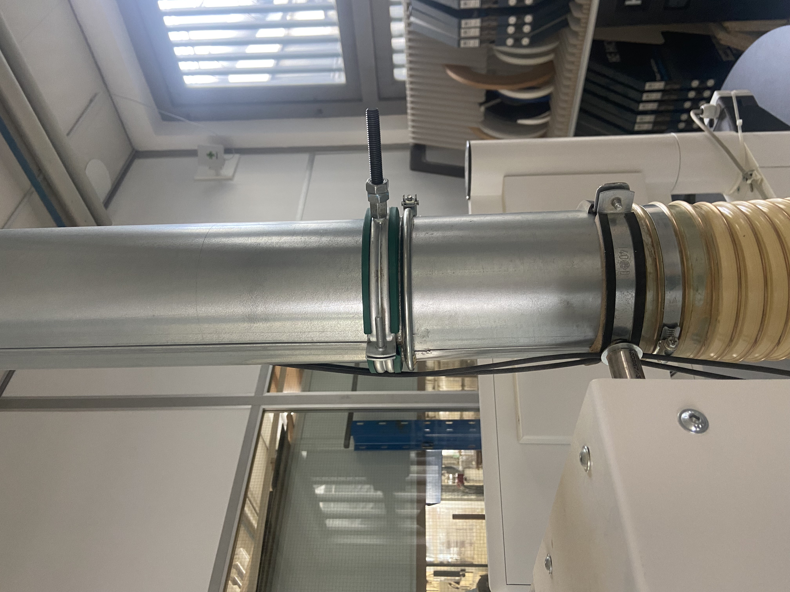

# Project_MOCAS
## Description
This project aims to detect and localize AGVs, persons and carriers inside a lab environment. This project intends to provide a stable, versatile and cost-effective alternative to high-end GPS based localization systems.

The intended solution to this problem is the implementation of a multi-camera system which can detect all objects with a YOLO v8n retrained network, and then use homography to locate the corresponding detection on the production floor plan. The resulting detection class, location and timestamp are then sent to an MQTT broker, from which a data fusion algorithm aggregates the data from all available sources. 

This document aims to give a general overview of the project, with each sub-repository containing detailed user and development instructions, as well as an evaluation of its shortfalls.

## Folder structure
<pre>
├── 01_calculate_homography/
├── 02_single_camera/
├── 03_code_for_yolov8n/
├── 04_modularized_DataFusion/
├── 05_precision_line_testing/
├── 06_Modularized_Servos/
└── README.md # This file
</pre>

## Implementation
Due to the complexity of the project, the implementation of the proposed solution was done gradually, following the pipeline shown in Figure 5:
- YOLO retraining: YOLO v8n was retrained with datasets representing our objects to be detected, and then compressed to be run on the RPI AI camera.
- Object detection: based on the provided example in the [`picamera2` repository](https://github.com/raspberrypi/picamera2/tree/main/examples/imx500)
- Detection tracking: BYTEtracker was implemented to track the detections given by teh RPI AI camera
- Pose estimation: Mediapipe was used to estimate the pose of people and detect their feet, to provide more accurate localization
- Homography calculation: A mathematical relationship is established between the camera and floor plane of the test room, to transform the camera coordinate systems to floor coordinate systems
- Localization: The bounding boxes bottom center point is fed to the homography matrix, providing then the localization of the detected object
- MQTT publishing: The resulting track data, including posiiton in the floor plane, is published to an MQTT broker
- Data fusion: An external device subscribes to the topic of all available cameras, and fuses the resulting data
- Modularized servos: Not a direct component of the pipeline, but an addition to increase flexibility while testing

 Figure 5: Pipeline of the MOCAS project


## Hardware
This project needs the following **hardware:**
- Raspberry Pi 5 (Figure 1)
- Raspberry Pi AI camera (Figure 1)
- Pan and tilt hat for the Raspberry Pi (Figure 1)
- Custom built platform to mount the Raspberry Pi on an M10 thread (Figure 2)
- Adapted case to mount the Raspberry Pi onto the platform (Figure 3)
- Hose clamps with an M10 thread, to mount the system on the lab's piping (Figure 4)

 Figure 1: Pan and tilt hat mounted onto the Raspberry Pi 5, with the AI camera attached to it
 Figure 2: Custom built platform for the system
 Figure 3: Adapted Raspberry Pi case to mount the RPI onto the platform
 Figure 4: Hose clamp mounted to the extraction hose of a machine


## Installation
For the installation of this project, clone the following repo
```
git clone git@inf-git.th-rosenheim.de:proto-lab-2.0/project_mocas.git
```
To create the Python virtual environments, refer to the corresponding `README.md` file for each section.

## Usage
This project consists of 4 main phases:

1. Preparation of the required resources:

- [YOLO training](./03_code_for_yolov8n/README.md) to allow for object detection

- [Calculation of the homography](./01_calculate_homography/README.md) to allow for object localization

2. Running and debugging the [single camera system](./02_single_camera/README.md)

3. Setting and running the [data fusion algorithm](./04_modularized_DataFusion/README.md)

4. Evaluating the results for a [single line test](./05_precision_line_testing/)

## TRL
Technical Readiness Level ([TRL](https://www.ble.de/SharedDocs/Downloads/DE/Projektfoerderung/Innovationen/Merkblatt-Technologiereifegrade.pdf?__blob=publicationFile&v=2)) is a measure of the maturity of a technology. It is a standardized way of tracking teh state of a project, with values ranging from 1 to 9. According to the proposed [TRL measurement document](https://horizoneuropencpportal.eu/sites/default/files/2022-12/trl-assessment-tool-guide-final.pdf), this project can be evaluated in 2 ways: as software and as a product.
- TRL as product: 6
    - Functional version of the product working on a realistic environment
    - Able to draw conclusions on the technical and operation capabilities of the product

- TRL as software: 4
    - Alpha version of the software tested internally (both functionalities and process) by the development team
    - Single camera system  closer to TRL 5, data fusion needs further improvement

## Next steps
1. Highest priority improvements:
    - Debugging of topic subscription, causes of data loss during fusion
    - Validate data sending of each device, study of the timing at arrival
    - Potential reimplementation of data fusion as probabilistic model
    - Stepwise testing of datafusion with off-line data to base decisions and performance evaluations of possible variants with the same inputs

2. Medium priority improvements:
    - Retest system on more realistic scenario, with a more complex path and higher variability of test conditions
    - Further improve homography quality with addition of more points
    - Improve multi-frame tracking to avoid double detections
    - Parameter optimisation of pose estimation

3. Long term changes for improved usage:
    - Improvement of servo movement system
    - Communication with 5G protocol


